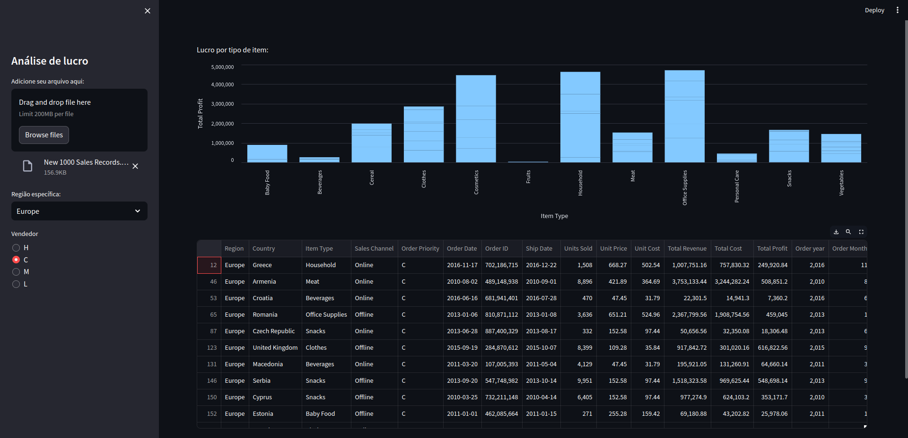

## Dashboard sobre análise de vendas

Aplicação desenvolvida com Python permitindo a análise interativa de dados de venda por meio do dashboard. Utilizando as bibliotecas Streamlit e Pandas, este projeto oferece uma interface amigável e intuitiva para visualização e exploração de informações relacionadas às vendas de uma empresa.

> "Ao desenvolver essa aplicação eu fiquei de cara com a facilidade na representação dos dados no gráfico utilizando o Streamlit. Com apenas algumas linhas de código, é possível criar visualizações poderosas e informativas, tornando a análise de dados mais acessível e intuitiva para todos os usuários."
  

---

### Tecnologias Utilizadas:
Python: Linguagem de programação principal para o desenvolvimento do projeto.  
Streamlit: Biblioteca para criação de aplicativos web com Python de forma rápida e fácil.  
Pandas: Biblioteca para manipulação e análise de dados.  
Outras bibliotecas: Outras bibliotecas de visualização de dados podem ser integradas conforme necessário.  

### Como Executar o Projeto:
Para executar o projeto localmente, siga estas etapas:

1. Clone o repositório para o seu ambiente local.  
2. Instale as dependências do projeto executando `poetry install`.  
3. Execute o aplicativo Streamlit com o comando `task run`.  
4. Acesse o dashboard no navegador da web através do link fornecido

----

Aplicação em desenvolvimento.